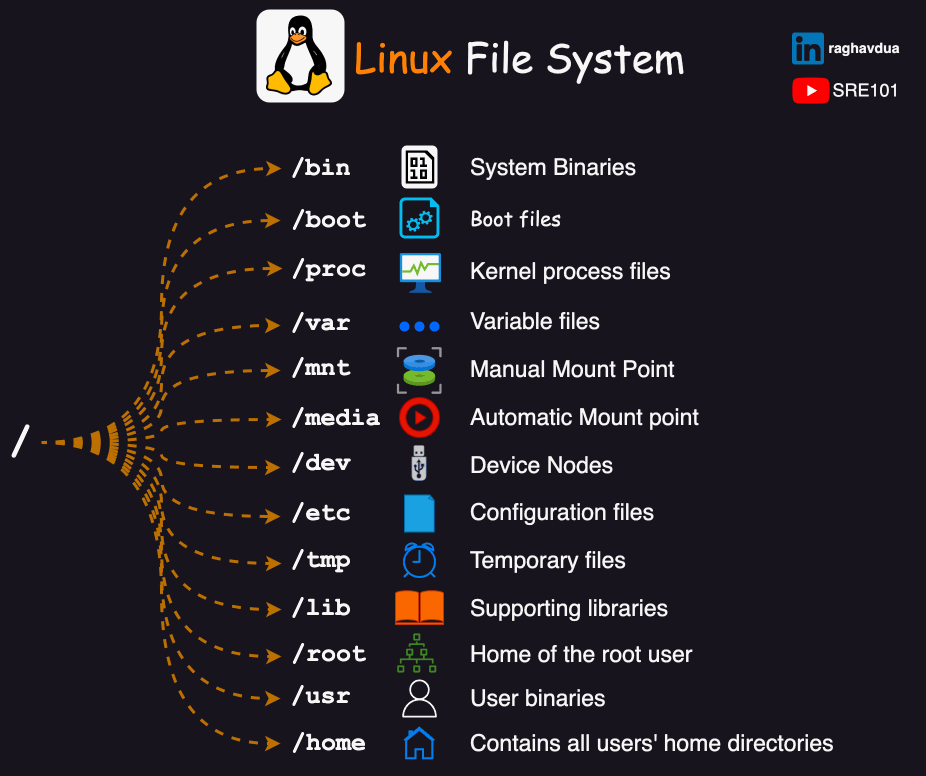

# **Basic Commands & Shell Scripts**

## Introduction

👋 In this section, we will explore some basic commands and essential shell scripts for certification.


## Basic Commands

* `pwd`: Displays the current directory path.
* `cd directory`: Changes to the specified directory.
* `cd ..`: Moves to the parent directory.
* `ls`: Lists files and directories in the current directory.
* `ls -l`: Lists detailed information about files and directories.
* `ls -a`: Lists all files, including hidden ones.
* `whoami`: Shows the current user’s name.
* `touch file`: Creates a new file.
* `mkdir dir`: Creates a new directory.
* `mkdir -p`: Creates directories recursively, including parents.
* `cat`: Displays file content.
* `echo "text"`: Prints text.
* `echo "text" > file`: Overwrites file content with text.
* `echo "text" >> file`: Appends text to the file.
* `command 2> file`: Sends error output to a file.
* `vim / nano`: Edits a file using Vim or Nano.
* `rmdir`: Removes an empty directory.
* `rm`: Deletes a file.
* `rm -rf`: Deletes a directory recursively and forcefully.
* `man / help`: Provides information about a command.
* `ctrl + a`: Moves cursor to the beginning of the line.
* `ctrl + e`: Moves cursor to the end of the line.
* `ctrl + c`: Stops a command.
* `history`: Displays command history.

## Lab 00

**Q1.** Navigate to your home directory:
<!-- 
```bash
cd ~
```
--> 
**Q2.** Create a directory named LinuxCommands:
<!-- 
```bash
mkdir LinuxCommands
```
--> 

**Q3.** Navigate to the LinuxCommands directory:
<!-- 
```bash
cd LinuxCommands
```
--> 

**Q4.** Create the directory structure course1/course2/course3/course4:
<!-- 
```bash
mkdir -p course1/course2/course3/course4
```


or step-by-step:

```bash
mkdir course1  
cd course1  
mkdir course2  
cd course2  
mkdir course3  
cd course3  
mkdir course4
```
--> 
**Q5.** Create files: file1, file2, file3, file4:
<!-- 
```bash
cd ~/LinuxCommands
touch file1 file2 file3 file4
```

or:

```bash
cd ~/LinuxCommands
touch file{1..4}
```
--> 
**Q6.** Check file owner and last modification date:
<!-- 
```bash
ls -l
```
--> 
**Q7.** Delete the LinuxCommands directory:
<!-- 
```bash
cd ..
rm -rf LinuxCommands
```
--> 
## Additional Commands

* `cp -rf source destination`: Copies a directory.
* `cp source destination`: Copies a file.
* `mv source destination`: Moves or renames a file/directory.
* `grep`: Searches for patterns in files.
* `grep -w`: Searches for exact words.
* `find`: Searches for files/directories.

**Syntax:**

```bash
find directory [options] [-exec cp -a {} destination \;]
```

**Options:**

* `-name`: File name
* `-group`: Group owner
* `-user`: File owner
* `-size`: Size n{k,M,G}, +n, -n
* `-perm`: Permission
* `-type`: f = file, d = directory

**Command:**

* `cp`: Copies found files (e.g., `cp -a {}`)

## Lab 01

**Q1.** Copy `/etc/passwd` to `/tmp`:

```bash
cp /etc/passwd /tmp
```

**Q2.** Copy `/etc/passwd` to home and rename it `mypasswd`:

```bash
cp /etc/passwd ~/mypasswd
```

**Q3.** Copy `/etc/shadow` to `/home/tekup` and extract lines with "!!":

```bash
mkdir /home/tekup
cp /etc/shadow /home/tekup
grep '!!' /home/tekup/shadow > nopass
```

**Q4.** Extract lines containing "seismic" to `/root/wordlist`:

```bash
grep -w seismic /usr/share/dict/words > /root/wordlist
```

**Q5.** Find all files owned by user "user":

```bash
find / -type f -user user 2> /dev/null
```

**Q6.** Find all files smaller than 1 KB in `/var`:

```bash
find /var -type f -size -1k
```

**Q7.** Find `.txt` files in `/root/Documents`:

```bash
find /root/Documents -name '*.txt'
```

**Q8.** Copy all files owned by "user" to `/root/dir`:

```bash
find / -type f -user user -exec cp -a {} /root/dir \;
```

**Q9.** Copy files larger than 100MB to `/backup`:

```bash
find / -type f -size +100M -exec cp -a {} /backup \;
```

**Q10.** Copy files with `640` permission to `/secure_backup`:

```bash
find /home/user/documents -perm 640 -exec cp -a {} /secure_backup \;
```

## Shell Scripts

* Scripts use `.sh` extension.
* Start with shebang: `#!/bin/bash` or `#!/bin/sh`.
* Display text: `echo “text”`
* Read variable: `read variable`
* Use variable: `$variable`
* Common environment variables:

  * `$HOME`: User’s home directory
  * `$USER`: Current username
  * `$UID`: User ID
  * `$(date)`: Current date/time
* Log message: `logger “text”`
* View logs: `journalctl | grep “text”`
* Execute script:

```bash
bash script.sh
# or
sh script.sh
# or make it executable
chmod +x script.sh
./script.sh
```

## Lab 02

**Q0.** Display “hello world!”:

```bash
vim hello.sh
#! /bin/bash
echo “hello world!”
bash hello.sh
```

**Q1.** Display current date:

```bash
vim date.sh
#! /bin/bash
echo “$(date)”
bash date.sh
```

**Q2.** Ask user for name, greet them, log the event:

```bash
vim greeting.sh
#! /bin/bash
echo “your name pls”
read name
echo “hello $name”
logger “user $name executed the greeting script”
bash greeting.sh
journalctl | grep user
```
