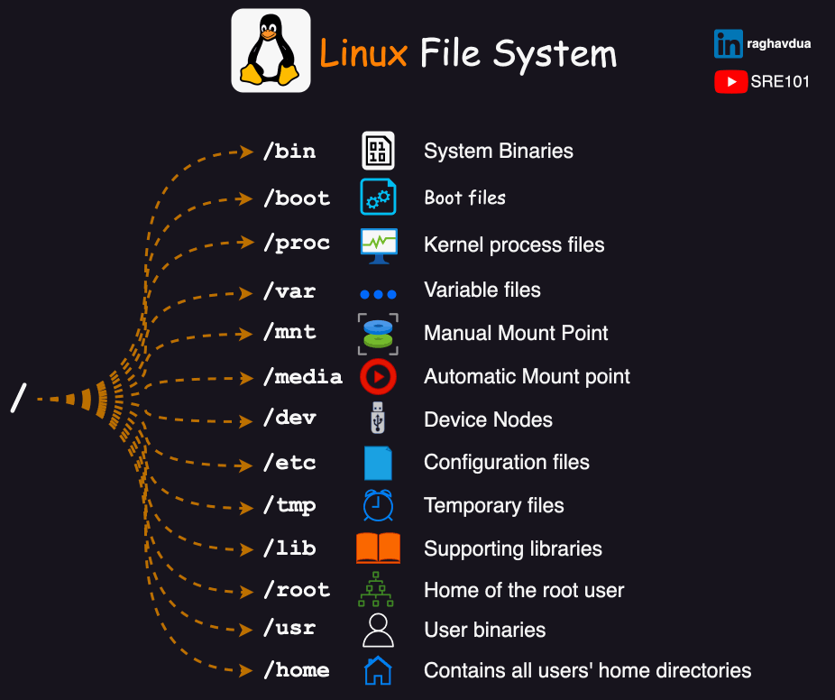

<h1 align="center" style="color: red;">Commandes basiques & Scripts Shell</h1>

## Introduction
👋 Dans cette section, nous allons explorer quelques commandes de base et les scripts shell essentiels pour la certification.
<p align="center">
  
</p>

## Commandes de Base
- `pwd` : Affiche le chemin du répertoire courant.
- `cd directory` : Change le répertoire courant vers "directory".
- `cd ..` : Change le répertoire courant vers le répertoire parent.
- `ls` : Liste les fichiers et répertoires du répertoire courant.
- `ls -l` : Liste les détails des fichiers et répertoires.
- `ls -a` : Liste tous les fichiers, y compris les fichiers cachés.
- `whoami` : Affiche le nom de l'utilisateur actuel.
- `touch file` : Crée un nouveau fichier.
- `mkdir dir` : Crée un nouveau répertoire.
- `mkdir -p` : Crée des répertoires récursivement, y compris les parents.
- `cat` : Affiche le contenu d'un fichier.
- `echo "text"` : Affiche du texte.
- `echo "text" > file` : Écrase le contenu du fichier avec le texte.
- `echo "text" >> file` : Ajoute du texte à la fin du fichier.
- `command 2> file` : Sends error output to file.
- `vim / nano` : Édite un fichier en utilisant l'éditeur Vim ou Nano.
- `rmdir` : Supprime un répertoire vide.
- `rm` : Supprime un fichier.
- `rm -rf` : Supprime un répertoire récursivement et de façon forcée.
- `man / help` : Fournit des informations sur la commande.
- `ctrl + a` : Déplace le curseur au début de la ligne.
- `ctrl + e` : Déplace le curseur à la fin de la ligne.
- `ctrl + c` : Arrête l'exécution d'une commande.
- `history` : Affiche l'historique des commandes.
## Lab 00
#### Q1. Navigate to your home directory.
<!-- 
```bash
cd ~
```
-->
#### Q2. Create a directory named LinuxCommands.
<!-- 
```bash
mkdir LinuxCommands
```
-->
#### Q3. Navigate to the LinuxCommands directory.
<!-- 
```bash
cd LinuxCommands
```
-->
#### Q4. Create the directory structure course1/course2/course3/course4 while remaining in the LinuxCommands directory.
<!-- 
```bash
mkdir -p course1/course2/course3/course4
```
or 
```bash
mkdir course1  cd course1 mkdir course2  cd course2  mkdir course3  cd course3  mkdir course4  
```
-->
#### Q5. Navigate into the LinuxCommands directory and create the following files: file1, file2, file3 and file4.  
<!-- 
```bash
cd ~/LinuxCommands  mkdir file1 file2 file3 file4
```
or 
```bash
cd ~/LinuxCommands  mkdir file{1,4}
```
-->
#### Q6. Determine the owner of the files and their last modification date.
<!-- 
```bash
ls -l 
```
-->
#### Q6. Delete the LinuxCommands directory.
<!-- 
```bash
cd ..  
rm -rf 
```
-->
- `cp -rf sourceLocation destinationLocation` : Copie un répertoire.
- `cp sourceLocation destinationLocation` : Copie un fichier.
- `mv sourceLocation destinationLocation` : Renomme ou déplace un fichier ou un répertoire.
- `grep` : Recherche des motifs dans un fichier.
- `grep -w` : Recherche un mot exact.
- `find` : Recherche des fichiers et des répertoires dans un répertoire.  
 Syntaxe: find répertoire [options] [-exec cp -a {} destination \;]  
 options:  
 -name: nom de fichier,  
 -group: le grp propriétaire,  
 -user: le propriétaire,  
 -size: taille n{k,M,G…} ou +n{k,M,G…} ou -n{k,M,G…},  
 -perm: permission,  
 -type: f pour fichier et d pour directory,  
 commande:  
 cp: copier les fichiers et les répertoires recherchés (cp -a {})  
## Lab 01
#### Q1. Copy '/etc/passwd' to '/tmp'.
<!-- 
```bash
cp /etc/passwd /tmp
```
-->
#### Q2. copy the file /etc/passwd to your home directory and name it mypasswd.
<!-- 
```bash
cp /etc/passwd ~/mypasswd
```
-->
#### Q3. Copy "/etc/shadow" to "/home/tekup/" and create a new file called "nopass" containing all lines with "!!".
<!-- 
```bash
mkdir /home/tekup
cp /etc/shadow /home/tekup
grep '!!' /home/tekup/shadow > nopass
```
-->
#### Q4. Find all lines in the file '/usr/share/dict/words' that contain the string "seismic". Copy all these lines to the file '/root/wordlist'.
<!-- 
```bash
grep -w seismic /usr/share/dict/words > /root/wordlist
```
-->
#### Q5. Locate all files owned by "user".
<!-- 
```bash
find / -type f -user user 2> /dev/null
```
-->
#### Q6. Find all files less than 1 KB size in '/var'.
<!-- 
```bash
find /var -type f -size -1k
```
-->
#### Q7. Find all files ending with ".txt" in the '/root/Documents' directory.
<!-- 
```bash
find /root/Documents -name *.txt
```
-->
#### Q8. Copy all files owned by "user" to "/root/dir".
<!-- 
```bash
find / -type f -user user -exec cp -a {} /root/dir \;
```
-->
#### Q9. Copy all files larger than 100 MB to the '/backup' directory.
<!-- 
```bash
find / -type f -size +100M -exec cp -a {} /backup \;
```
-->
#### Q10. Copy all files in the "/home/user/documents" directory that have read and write permissions for the owner, read-only permission for the group, and no permission for others to the "/secure_backup" directory.
<!-- 
```bash
find /home/user/documents -perm 640 -exec cp -a {} /secure_backup \;
```
-->
## script shell
- Le fichier doit avoir l'extension `.sh` . (indique que le fichier est un script shell)
- doit commencer par le shebang : `#!/bin/bash` ou `#!/bin/sh`. ( indique au système quel interpréteur utiliser pour exécuter le script.)
- afficher du texte: `echo “texte”`
- entrer une variable : `read variable`
- appel variable: `$variable`
- Variable d'environnement pour le répertoire personnel de l'utilisateur actuel: `$HOME`
- Variable d'environnement pour le nom d'utilisateur de l'utilisateur actuel : `$USER`
- Variable d'environnement qui affiche L'identifiant de l'utilisateur actuel: `$UID`
- Variables d'environnement pour la date et l'heure actuelles: `$date`
- enregistrer des messages dans le journal du système: `logger “texte”`
- vérifier le texte de journal du système: `journalctl | grep “texte”`
- pour exécuter les scripts : `bash fichier.sh` ou `sh fichier.sh` ,
ou `chmod +x fichier.sh` puis `./fichier.sh`.

## Lab 02
#### Q0. display the message hello world!.
<!-- 
```bash
vim hello.sh
#! /bin/bash
echo “hello world!”
bash hello.sh
-->
#### Q1. display the current date using a script shell.
<!-- 
```bash
vim date.sh
#! /bin/bash
echo “$date”
bash date.sh
-->
#### Q2. Ask the user for their name, Greet the user then Log the event in the system logs using a script called greeting.sh.
<!-- 
```bash
vim greeting.sh
#! /bin/bash
echo “your name pls”
read nom
echo “hello $nom”
logger “user $nom executed the greeting script”
bash greeting.sh
journalctl | grep user 
-->
<p style="text-align: right;">
  <a href="https://github.com/halekammoun/RHCSA-Training/blob/main/README.md#table-des-matieres">Retour à la Table des Matières</a>
</p>