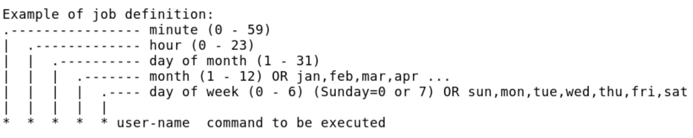

<h1 align="center" style="color: red;">Task Automation</h1>

## Introduction

👋 In this section, we will explore how to automate tasks using the `crontab` command.

The `crontab` command allows you to schedule tasks to run automatically at regular intervals.

### Main Commands

* `crontab -e`: to edit the crontab of the currently logged-in user.
* `crontab -e -u username`: to edit the crontab of a specific user.
* `cat /etc/crontab`: to view the current configuration details.

<p align="center">
  
</p>  

### Time Intervals

* `@hourly`: every hour.
* `@daily`: every day.
* `@weekly`: every week.
* `@monthly`: every month.
* `@annually`: every year.
* `@reboot`: at every system reboot.

### Notes on Intervals

* `x,y`: x and y.
* `x-y`: from x to y.
* `x-y/z`: from x to y with a step of z.
* `*`: every unit.
* `*/z`: every z units.

## Lab 05

#### Q0. Delete the contents of /tmp every Wednesday at 3:15 PM and at 12:30 PM for user1.

```bash
crontab -e -u user1
30,15 12,15 * * 3 rm -rf /tmp
```

#### Q1. Execute the script `backup.sh` at every system reboot.

```bash
@reboot bash backup.sh
```

#### Q2. Write the message “hello” into `hello.txt` every 3 minutes.

```bash
crontab -e
*/3 * * * * echo “hello” >> hello.txt
```

#### Q3. As the user natasha, schedule a task to log the following text every 5 minutes: “Examen en cours”.

```bash
crontab -e -u natasha
*/5 * * * * logger “Examen en cours”
```

#### Q4. Configure a task for user natasha to run every 2 minutes from Monday to Friday to insert the message “Examen EX200 en cours” into the logs.

```bash
crontab -e -u natasha
*/2  * * * 1-5  logger “Examen EX200 en cours”
```

<p style="text-align: right;">
  <a href="https://github.com/halekammoun/RHCSA-Training/blob/main/README.md#table-des-matieres">Back to Table of Contents</a>
</p>
