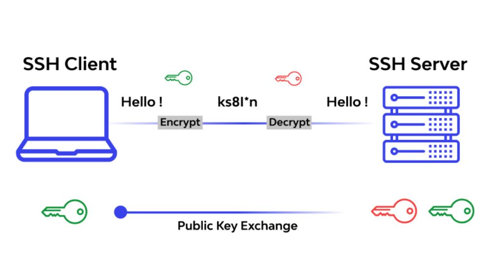
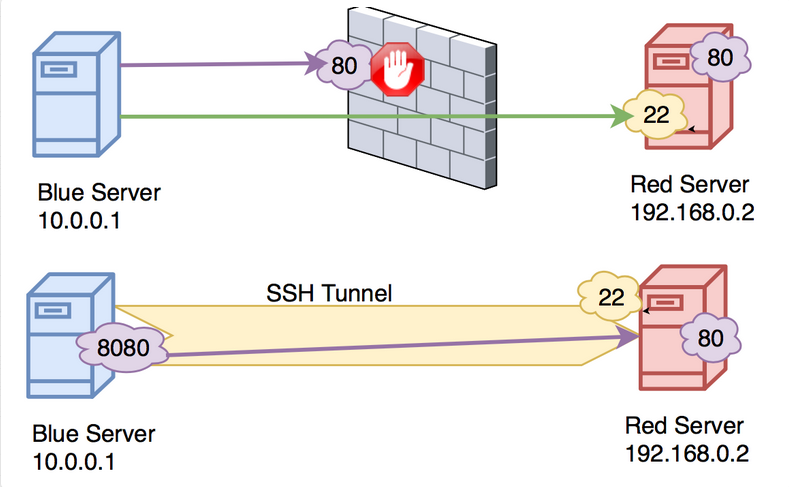
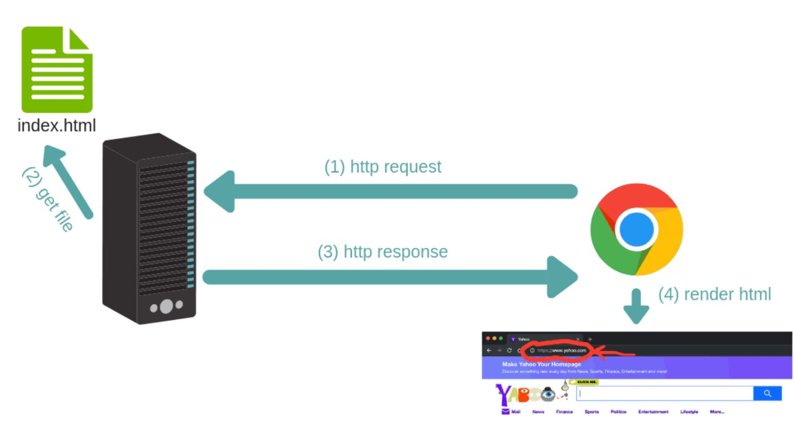
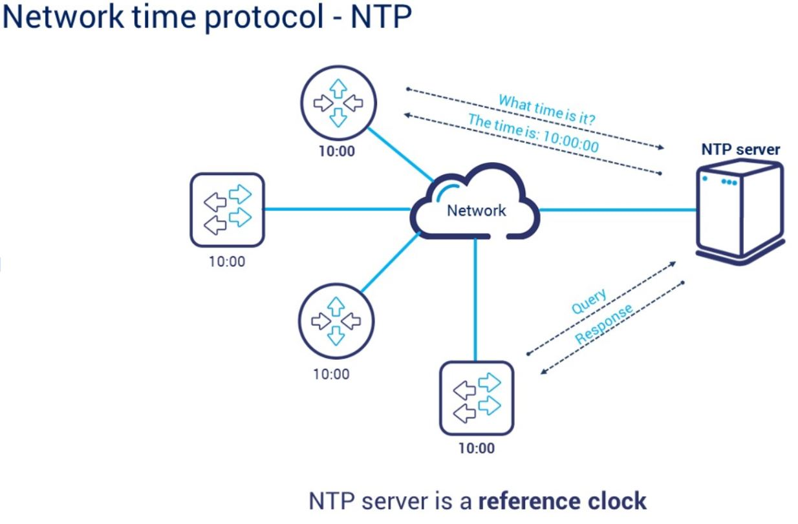

<h1 align="center" style="color: red;">Gestion des Services</h1>

## Introduction
👋 Dans cette section, nous allons apprendre à configurer et gérer le service SSHD,HTTPD et NTP. 
## Service SSHD:
### théorie:

  

  
En termes simples, le SSH permet à un utilisateur de se connecter à un autre ordinateur de manière sécurisée, comme s'il était physiquement présent devant cet ordinateur. Il utilise une cryptographie forte pour sécuriser la communication entre les deux machines, ce qui signifie que les données échangées, y compris les identifiants et les commandes, sont protégées contre les interceptions.  
RQ: Ports bien connus : numérotés de 0 à 1023, ils sont associés à des services standardisés comme HTTP (port 80) et SSH (port 22)...  

### pratique:
- `yum install openssh-server` →  installation du serveur SSH (machine en tant que serveur SSH ).
- `systemctl enable sshd `
- `sudo systemctl start sshd` → démarrer et activer le service sshd.(machine en tant que serveur SSH ).
RQ: Chaque service sur Red Hat bénéficie de deux couches de sécurité par défaut qui sont  le Pare-feu (`Firewalld`) & `SELinux` (Security-Enhanced Linux).  

  

 

- `firewall-cmd --add-port=22/tcp --permanent`
- `firewall-cmd --reload`
- `firewall-cmd --list-ports` → ouvrir le port ssh pour les connexions entrantes sur la machine B(machine en tant que client SSH ).
- `ssh username@adresse_ip_machine_b` → tester la connexion SSH (machine en tant que client SSH ).  
#### connexion à une autre machine via ssh en utilisant un mot de passe: 
-  `ssh user_client@address_client ` → (the user must have a password)  
ou  
- `vim/etc/hosts `  
 `address_client	hostname ` → définir un hostname pour l’adresse ip de chaque machine.  
- `ssh user_client@hostname `  
#### connexion à une autre machine via ssh sans mot de passe: 
Pour autoriser une connexion sans mot de passe il faut générer et configurer les clés SSH sur la machine (A) et les ajouter à l’autre machine, Cela lui permet de reconnaître et d'autoriser les connexions provenant de la machine A.  
-  `ssh-keygen -t rsa ` → Génération des clés SSH.(sur la machine qui souhaite une connexion sans mot de passe).
-  `ssh-copy-id user@machine_b ` → copie la clé publique de la Machine A vers la Machine B et l'ajoute au fichier authorized_keys dans le répertoire .ssh de l'utilisateur sur la Machine B.
-  `ssh user@machine_b `
#### connexion à une autre machine en utilisant un port autre que 22:  
on sait que par défaut le port de ssh est 22 on peut le changer:  
- `ssh user@client_address then su -` →  se connecter au client via ssh puis en tant que root.
- `vim /etc/ssh/sshd_config`
`port 2222` →  changer le port de 22 à 2222.  
- `man semanage port`
`semanage port -a -t ssh_port_t -p tcp 2222` → ajouter le nouveau port a selinux 2222.  
- `firewall-cmd --permanent --add-port=2222/tcp`
- `firewall-cmd --reload` → ajouter le port dans le firewall.  
- `systemctl restart sshd` →  restart the service.  
- `exit then exit then`
- `ssh user@client_address -p 2222` →  se connecter avec le nv port.

## Service httpd:
### théorie:

  

  
Le serveur web stocke tous les fichiers nécessaires à la fourniture du contenu d'un site web, y compris les fichiers pour les pages statiques et les applications pour les pages dynamiques. Le rôle du serveur web est de servir ces fichiers et de gérer les interactions entre le navigateur de l'utilisateur et les ressources du site web.  
une requête HTTP (GET) est comme une commande passée au serveur pour obtenir un fichier spécifique (dans ce cas, "index.html"), et la réponse HTTP est la manière dont le serveur répond à cette demande, en envoyant le contenu demandé (le fichier HTML dans ce cas) en retour.

- `/var/www/html`  est un chemin de répertoire couramment utilisé pour stocker les fichiers qui sont servis par un serveur web.
- `"index.html"` (/var/www/html/index.html) est un fichier HTML qui sert de page d'accueil ou de point de départ pour un site web.
### pratique:
- `dnf install httpd`
- `systemctl enable --now httpd` →  installer et activer le service.
- `systemctl status httpd` →  vérifier que le service est activé.
- `echo "bnj" >> /var/www/html/index.html`
`firewall-cmd --permanent --add-service=http`
`firewall-cmd --permanent --add-service=https`
`firewall-cmd --reload ` → ajouter http et https dans le firewall rules.  
Alors, si vous placez un fichier index.html dans /var/www/html et que votre serveur web est en cours d'exécution, l'accès à l'adresse IP ou au domaine du serveur dans un navigateur web affichera le contenu de index.html.
- `dnf install curl`
- `curl http://@server/index.html`  
(si n’est pas fonctionné chown apache:apache /var/www/html/index.html)
#### Changer le port 80 en <nv_port>
- `vim /etc/httpd/conf/httpd.conf`
`listen <nv_port>`
- `man semanage port`
`semanage port -a -t http_port_t -p tcp <nv_port>` → ajouter le nouveau port a selinux.
- `firewall-cmd --permanent --add-port=<nv_port>/tcp`
`firewall-cmd --reload` → ajouter le port dans le firewall 
`systemctl restart httpd` → changer port dans le fichier de config
- `curl localhost:<nv_port>/index.html` → vérifier le nouveau port.
#### Changer le répertoire par défaut /var/www/html vers /var1/web/html
- `vim /etc/httpd/conf/httpd.conf`  
`DocumentRoot "/var1/web/html"`

`<Directory "/var1/web">`  
    `AllowOverride None`  
    `Require all granted`  
`</Directory>`  
`<Directory "/var1/web/html">`  
- `man semanage fcontext`
`semanage fcontext -a -t httpd_sys_content_t "/var1/web/html(/.*)?"`  
`restorecon -R -v /var1/web/html/`  
- `echo "hello2" >> /var1/web/html/test.html`
- `systemctl restart httpd`
- `curl localhost/test.html` ou `curl  http://@iphost/test.html`
## Service NTP:
### théorie:

  

 
Un serveur NTP est un serveur qui fournit l'heure précise aux ordinateurs clients sur un réseau.  
Il maintient une horloge précise en se synchronisant régulièrement avec des sources de temps précises, telles que des serveurs de temps atomiques ou GPS.  
Le serveur NTP répond aux requêtes des clients pour fournir l'heure actuelle avec une précision élevée. 

### pratique:
#### partie serveur: allow client access to time
- `dnf install chrony`
- `systemctl enable chronyd`
`systemctl start chronyd` → installer et activer le service.
- `vim /etc/chrony.conf`  
`allow @ipclient`  
- `systemctl restart chronyd`  
- `firewall-cmd --add-service=ntp --permanent`  
`firewall-cmd --reload`
#### partie client: access to time
- `dnf install chrony`
- `systemctl enable chronyd`  
`systemctl start chronyd` → installer et activer le service
- `vim /etc/chrony.conf`  
`server @ipserver iburst`  
- `systemctl restart chronyd`  
- `chronyc sources -c` → pour vérifier.
pour activer ntp:
- `timedatectl set-ntp true`  
`timedatectl`
set a time zone:
- `timedatectl list-timezones`  
`timedatectl set-timezone <zone>`  
`timedatectl`
