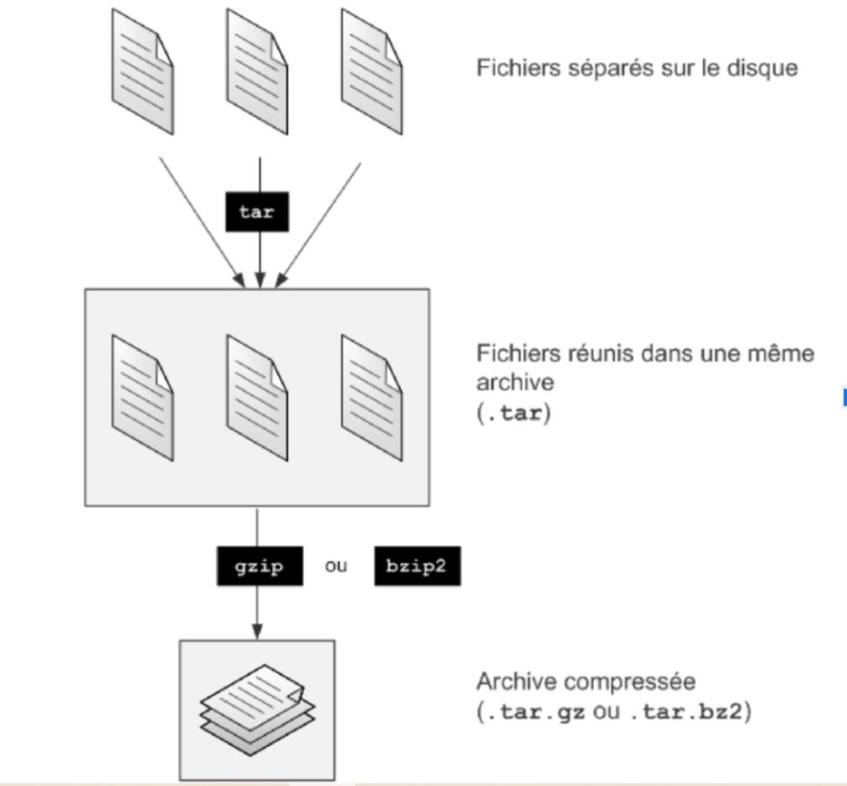

<h1 align="center" style="color: red;">Archivage & Compression</h1>

## Introduction
👋 Dans cette section, nous allons explorer comment archiver et compresser les répertoires dans un environnement Redhat Linux.
### théorie:
<p align="center">
  
</p> 

- `tar -cvf archivename.tar répertoire` → réunir les fichiers dans un seul gros fichier appelé archive.  (étape 1)
- `tar -tvf archivename.tar` → lister le contenu d’une archive.
Compresser le gros fichier obtenu à l’aide de gzip ou de bzip2: (étape 2)
- `gzip archivename.tar` →  compression d’une archive avec gzip.
- `gzip -d archivename.tar.gz` → décompression d’une archive avec gzip.
- `bzip2 archivename.tar` →  compression d’une archive avec bzip2.
- `bzip2 -d archivename.tar.bz2` → décompression d’une archive avec bzip2.
tu peux faire les deux étapes simultanément (archivage+compression):
- `tar -cvzf répertoire.tar.gz répetoire` → archiver et compresser un répertoire vers gzip.
- `tar -cvjf répertoire.tar.bz2 répertoire` → archiver et compresser un répertoire vers bzip2.
- `ls -lh` → pour vérifier la taille
## Lab 06
#### Q0. Create an archive named "documents.tar.gz" containing all files of the "/home/user/documents" directory.

```bash
tar -cvzf document.tar.gz /home/user/documents
```

#### Q1. Compress the entire "/var/log" directory into a file named "logs_backup.tar.bz2".

```bash
tar -cvjf logs_backup.tar.bz2 /var/log
```


#### Q2. Make a compressed backup of the "/etc" directory and save it as "etc_backup.tar.gz" .
```bash
tar -cvzf etc_backup.tar.gz /etc
```


<p style="text-align: right;">
  <a href="https://github.com/halekammoun/RHCSA-Training/blob/main/README.md#table-des-matieres">Retour à la Table des Matières</a>
</p>


