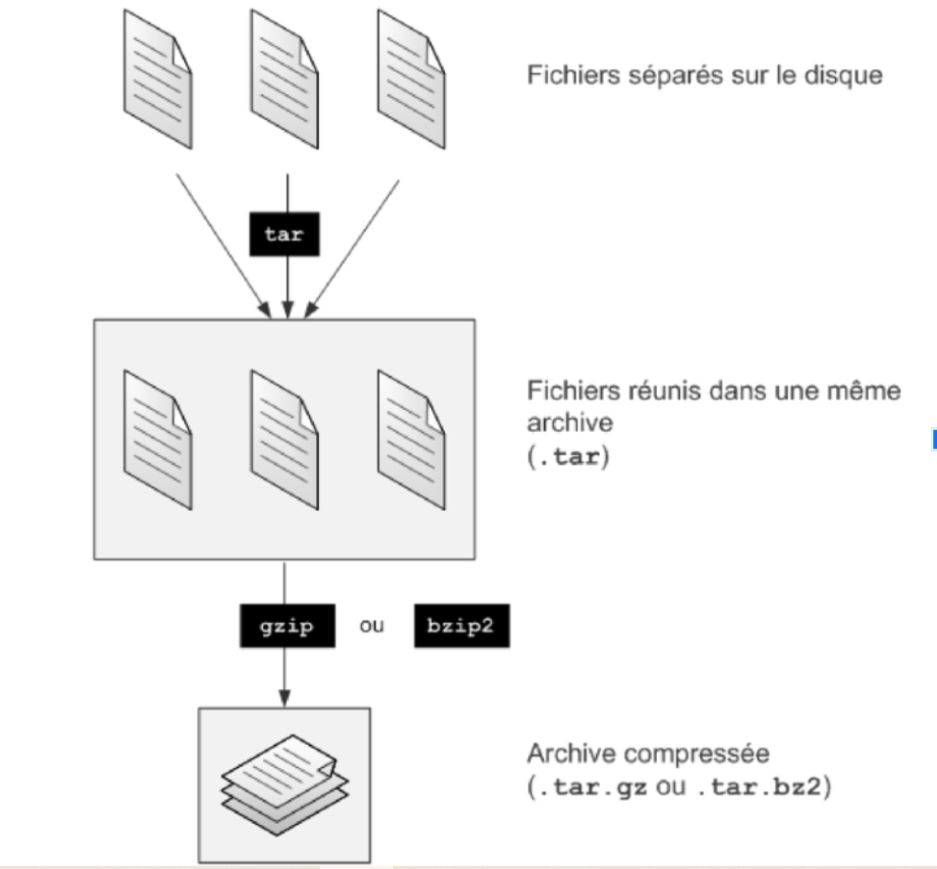

<h1 align="center" style="color: red;">Archiving & Compression</h1>

## Introduction

👋 In this section, we will explore how to archive and compress directories in a Red Hat Linux environment.

### Theory:

<p align="center">
  
</p> 

* `tar -cvf archivename.tar directory` → gather files into a single large file called an archive. (Step 1)
* `tar -tvf archivename.tar` → list the contents of an archive.

Compress the resulting large file using gzip or bzip2: (Step 2)

* `gzip archivename.tar` → compress an archive with gzip.
* `gzip -d archivename.tar.gz` → decompress a gzip archive.
* `bzip2 archivename.tar` → compress an archive with bzip2.
* `bzip2 -d archivename.tar.bz2` → decompress a bzip2 archive.

You can also perform both steps at once (archiving + compression):

* `tar -cvzf directory.tar.gz directory` → archive and compress a directory using gzip.
* `tar -cvjf directory.tar.bz2 directory` → archive and compress a directory using bzip2.
* `ls -lh` → check the file size.

---

## Lab 06

#### Q0. Create an archive named "documents.tar.gz" containing all files in the "/home/user/documents" directory:

```bash
tar -cvzf document.tar.gz /home/user/documents
```

#### Q1. Compress the entire "/var/log" directory into a file named "logs\_backup.tar.bz2":

```bash
tar -cvjf logs_backup.tar.bz2 /var/log
```

#### Q2. Make a compressed backup of the "/etc" directory and save it as "etc\_backup.tar.gz":

```bash
tar -cvzf etc_backup.tar.gz /etc
```

<p style="text-align: right;">
  <a href="https://github.com/halekammoun/RHCSA-Training/blob/main/README.md#table-des-matieres">Back to Table of Contents</a>
</p>

