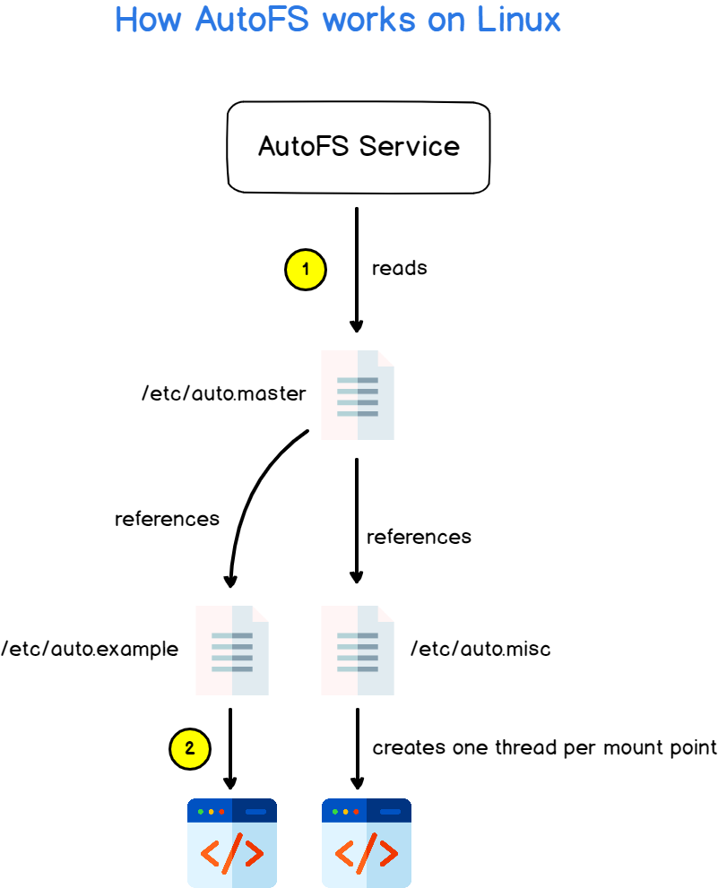

<h1 align="center" style="color: red;">NFS & AutoFS</h1>

## Introduction
👋 Dans cette section, nous allons explorer comment gérer un serveur NFS dans un environnement Redhat Linux.
## NFS:

### théorie:  
<p align="center">
  
</p> 

file server?  
un ordinateur responsable du stockage afin que d'autres ordinateurs du même réseau puissent accéder aux fichiers, via Network share: NFS (protocol of Network share in linux)  
how to use NFS service?  
the server export the directory then the client mount the nfs filesystem.  
any service have a layering protection: firewall; firewalld-cmd command (default: rules are blocked),  selinux; semanage command (security enhanced linux)  
### pratique:
partie serveur: (must be root: su -)
- `dnf install nfs*` → install the service
- `systemctl enable --now nfs-server` → enable & start the service  
(or systemctl enable nfs-server then systemctl start nfs-server)  
- `systemctl status nfs-server`  → verify the status of the service
configuration?
- `mkdir /shared_directory` → create the directory to share
- `echo “/shared_directory	@ipclient(x ,y) ” /etc/exports` → configure the shared directory in the server.  
`x can be ro or rw & y can be no_root_squash or async`  
`no_root_squash` → le super utilisateur du client conserve ses privilèges complets sur les fichiers partagés.  
`root_squash` → (default) les privilèges de client sont limités même pour le superutilisateur du client.  
`rw` → the shared directory will be readable and writable for the client. 
`ro` → the shared directory will be just readable for the client.  
`sync` → (default)  synchronous connexion; the server waits for data to be physically written to the disk (of client) before responding to the client's write request.  
`async` → asynchronous connexion; the NFS server can respond to the client before the data is physically written to the disk.
- `systemctl restart nfs-server` → restarting the service because we modified its configuration file (/etc/exports)
- `semanage boolean -l | grep nfs_export_all_ro` → verifying that nfs is allowed to export with ro mode: must be on
- `semanage boolean -l | grep nfs_export_all_rw` → verifying that nfs is allowed to export with ro mode: must be on
- `setsebool -P nfs_export_all_rw=1` → allow sharing with rw mode
- `setsebool -P nfs_export_all_ro=1` → allow sharing with ro mode
- `firewall-cmd --list-all` → to see enabled services
- `firewall-cmd --add-service=nfs --permanent` → to allow nfs service
- `firewall-cmd --reload` → to reload firewall rules
-`exportfs -avr` → to export the directory to the client  
partie client: (must be root: su -)
- `dnf install nfs-utils` → install the service
- `mkdir /mount_point`→ create the directory where you will mount the shared_directory
- `mount -t nfs -o rw @ipserver:/shared_directory /mount_point` →  mount the shared_directory  
(umount /shared_directory →  to unmount the shared_directory)
- `echo “@ipserver:/shared_directory /mnt/mount_point nfs _netdev 0 0” >> /etc/fstab` →  mount the shared_directory permanently.
- `mount -a` →  to execute the /etc/fstab
- `df -h` →  to verify
## AutoFS:

### théorie: 

<p align="center">
  
</p> 

Autofs?  

on demand NFS ou montage automatique de répertoire partagé.  
Autofs permet un montage automatique à la demande des systèmes de fichiers, tels que les partages NFS, lorsque les utilisateurs accèdent à des répertoires spécifiques. Cela contribue à optimiser l'utilisation des ressources système en ne montant les systèmes de fichiers que lorsque nécessaire.  
server → exports  
client → auto mount (auto.master & auto.misc)  
Use case: to share the home directory (server) so its user can use it when he create the session (client).  
Q0. Create a user named john on the two machines with uid 2001. His home directory on the server is named /host/john. It will be mounted on /host/john with Autofs when john connects.  
NB:the user in the server must have a base directory, the client must not have a directory :for testing.  

Partie serveur:
- `dnf install nfs*`
- `useradd -u 2001 -b /host john` →  créer base du répertoire personnel à partager dans le serveur.
- `echo “/host 	*(rw,no_root_squash) ” >> /etc/exports` →  modifier le fichier de configuration pour exporter le ‘base directory’.
- `firewall-cmd --add-service rpc-bind --permanent`
- `firewall-cmd --add-service mountd --permanent`
- `firewall-cmd --add-service nfs --permanent`
or just  
- `firewall-cmd --add-service={rpc-bind,nfs,mountd} --permanent`
- `firewall-cmd --reload` →  ajouter les services nécessaires pour le montage automatique.
- `exportfs -arv` →  exporter le base directory.  
Partie client:  
- `dnf install nfs-utils`
- `dnf install autofs` →  installer les packages nécessaires.
- `//useradd -M -u 2001 -d /host/john john` →  créer un utilisateur sans répertoire personnel.
- `echo “/host		/etc/auto.misc” >> /etc/auto.master`
- `echo “john -rw  @ipserver:/host/john” >> /etc/auto.misc` →  configurer le montage automatique de répertoire personnel.
- `systemctl restart nfs-server`
- `systemctl restart autofs`
<h1 align="center" style="color: red;">Lab d'évaluation 02</h1>

```bash
Lab part 2:
Q1. Create a cron job running as root, starting at 10PM every day and executing the script hello.sh.
Q2. Make necessary configurations so that httpd runs on port 93 using /tekup as its documentRoot.
Q3. Archiver et compressez le répertoire /tmp afin d’obtenir tmp.tgz
Q4. Un partage NFS a été effectué depuis le serveur domain11.example.com(192.168.0.24):192.168.0.24:/remoteuser/user20.  
Configurez ce partage pour que son répertoire personnel soit monté automatiquement sous /remoteuser/user20.  
Q5. Dans le fichier /etc/passwd, le répertoire de base de l’utilisateur est /remoteuser/user20.
```
<!--
```bash
Lab part 2:
Create a cron job running as root, starting at 10PM every day and executing the script hello.sh.
crontab -e
0 22 * * * bash hello.sh
Archiver et compressez le répertoire /tmp afin d’obtenir tmp.tgz
tar -cvzf tmp.tar.gz /tmp
Un partage NFS a été effectué depuis le serveur domain11.example.com  (192.168.0.24) : 192.168.0.24:/remoteuser/user20.
Configurez ce partage pour que son répertoire personnel soit monté automatiquement sous /remoteuser/user20. 
Dans le fichier /etc/passwd, le répertoire de base de l’utilisateur est /remoteuser/user20.
partie serveur:
dnf install nfs*
useradd -u 2222 -b /remoteuser user20 
echo “/remoteuser 	*(rw,no_root_squash) ” >> /etc/exports
firewall-cmd --add-service {rpc-bind,mountd,nfs} --permanent
firewall-cmd --reload
exportfs -arv
partie client:
dnf install nfs-utils
dnf install autofs
useradd -M -u 2222 -d /remoteuser/user20 user20
echo “/remoteuser		/etc/auto.misc” >> /etc/auto.master
echo “user20 -rw  192.168.0.24:/remoteuser/user20” >> /etc/auto.misc
systemctl restart autofs
```

-->

<p style="text-align: right;">
  <a href="https://github.com/halekammoun/RHCSA-Training/blob/main/README.md#table-des-matieres">Retour à la Table des Matières</a>
</p>
