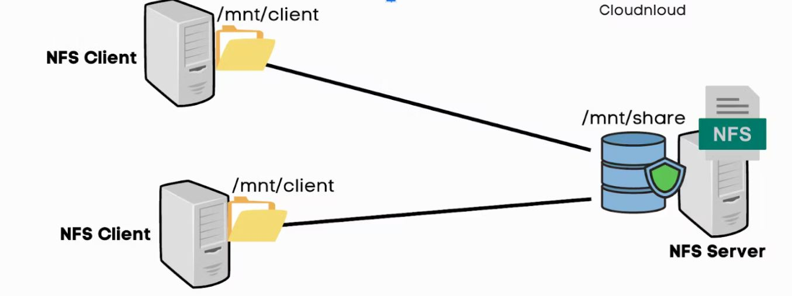

<h1 align="center" style="color: red;">NFS & AutoFS</h1>

## Introduction
👋 Dans cette section, nous allons explorer comment gérer un serveur NFS dans un environnement Redhat Linux.
## NFS:

### théorie:  

  

 

file server?  
un ordinateur responsable du stockage afin que d'autres ordinateurs du même réseau puissent accéder aux fichiers, via Network share: NFS (protocol of Network share in linux)  
how to use NFS service?  
the server export the directory then the client mount the nfs filesystem.  
any service have a layering protection: firewall; firewalld-cmd command (default: rules are blocked),  selinux; semanage command (security enhanced linux)  
### pratique:
partie serveur: (must be root: su -)
- `dnf install nfs*` → install the service
- `systemctl enable --now nfs-server` → enable & start the service  
(or systemctl enable nfs-server then systemctl start nfs-server)  
- `systemctl status nfs-server`  → verify the status of the service
configuration?
- `mkdir /shared_directory` → create the directory to share
- `echo “/shared_directory	@ipclient(x ,y) ” /etc/exports` → configure the shared directory in the server.  
`x can be ro or rw & y can be no_root_squash or async`  
`no_root_squash` → le super utilisateur du client conserve ses privilèges complets sur les fichiers partagés.  
`root_squash` → (default) les privilèges de client sont limités même pour le superutilisateur du client.  
`rw` → the shared directory will be readable and writable for the client. 
`ro` → the shared directory will be just readable for the client.  
`sync` → (default)  synchronous connexion; the server waits for data to be physically written to the disk (of client) before responding to the client's write request. 
`async` → asynchronous connexion; the NFS server can respond to the client before the data is physically written to the disk.
- `systemctl restart nfs-server` → restarting the service because we modified its configuration file (/etc/exports)
- `semanage boolean -l | grep nfs_export_all_ro` → verifying that nfs is allowed to export with ro mode: must be on
- `semanage boolean -l | grep nfs_export_all_rw` → verifying that nfs is allowed to export with ro mode: must be on
- `setsebool -P nfs_export_all_rw=1` → allow sharing with rw mode
- `setsebool -P nfs_export_all_ro=1` → allow sharing with ro mode
- `firewall-cmd --list-all` → to see enabled services
- `firewall-cmd --add-service=nfs --permanent` → to allow nfs service
- `firewall-cmd --reload` → to reload firewall rules
-`exportfs -avr` → to export the directory to the client
partie client: (must be root: su -)
- `dnf install nfs-utils` → install the service
- `mkdir /mount_point`→ create the directory where you will mount the shared_directory
- `mount -t nfs -o rw @ipserver:/shared_directory /mount_point` →  mount the shared_directory  
(umount /shared_directory →  to unmount the shared_directory)
- `echo “@ipserver:/shared_directory /mnt/mount_point nfs _netdev 0 0” >> /etc/fstab` →  mount the shared_directory permanently.
- `mount -a` →  to execute the /etc/fstab
- `df -h` →  to verify
