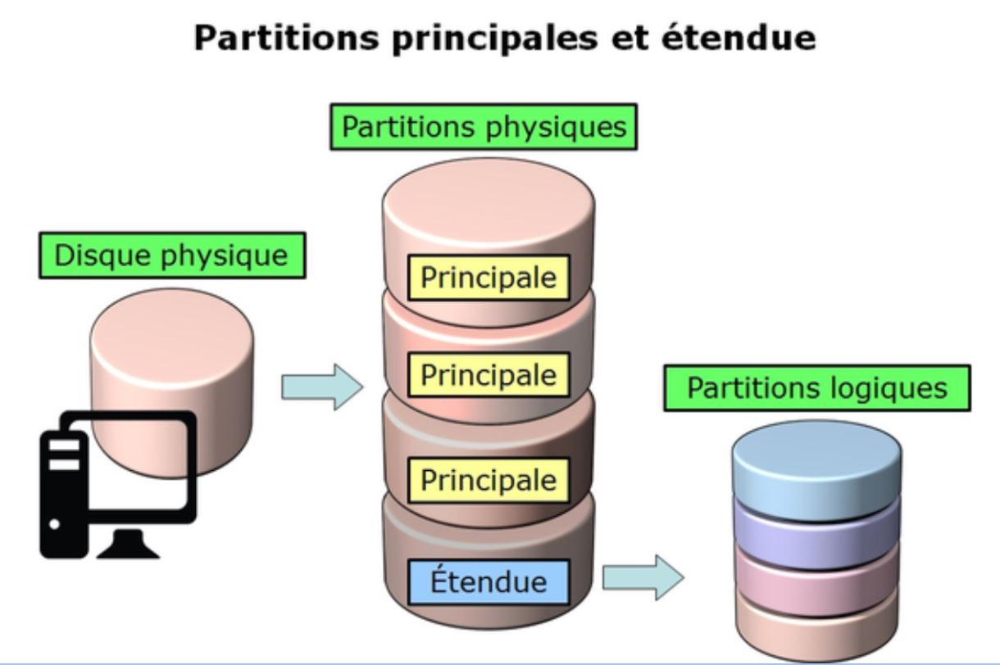

<h1 align="center" style="color: red;">Gestion de stockage</h1>

## Introduction
👋 Dans cette section, nous allons explorer comment gérer les disques, les partitions, LVM et stratis sous un environnement Redhat Linux.
## Disque & Partitions:
<p align="center">
  
</p> 


### théorie:

- partitionnement: créer une ou plusieurs zones de stockage indépendantes.
- Organisation du disque avec MBR: maximum 4 partitions: 4 principaux et une partition étendue qui peut contenir plusieurs partitions logiques.
- exemple: 
pour périphérique SATA:  
on dit /dev/sda pour la première  disque sata.  
on dit /dev/sdb pour le deuxième disque sata…  
on dit /dev/sda1 pour la première partition de la première disque sata.  
on dit /dev/sda2 pour la deuxième partition du premier disque sata…  
- Les formats des systèmes de fichiers: c’est comment linux organise et stocke ses fichiers sur un périphérique de stockage: ext2, ext3, ext4, jfs, xfs..  
- montage: intègre un système de fichiers dans l'arborescence, une fois que vous avez monté le disque, vous pouvez naviguer dans ses fichiers comme si c'étaient ceux de votre ordinateur principal.  
- partition SWAP : Une partition swap sur un disque dur agit comme un espace de stockage temporaire utilisé par le système d'exploitation pour déplacer des données inactives de la mémoire vive (RAM) vers le disque.  
- `lsblk` → pour voir les disques et les partitions
- `fdisk /dev/nom_disque then n (new)`→  pour créer une partition.  
- `mkfs.filesystem_name /dev/nom_partition`→  pour formater une partition.
- `mkdir /mount_point` →  créer le point de montage.
- `blkid /dev/nom_partition` →  afficher le uuid de partition.
- `echo “UUID=uuid_of_the_partition		/mount_dir	xfs		defaults	0 0” >> /etc/fstab `
then 
- `mount -a`→  monter la partition (permanent)  
pour effacer une partition déjà monté:  
RQ: il faut démonter avant d' effacer une partition.
effacer la ligne dans /etc/fstab si c’est monté (permanently) then mount -a.  
- `umount nom_partition`.
- `fdisk /dev/nom_disque then d (delete) then w`→  pour effacer la partition.  
RQ: il faut démonter avant de changer le type de partition (par exemple to swap)  
pour créer une partition SWAP( créer une partition puis changer le type en swap):  
- `fdisk /dev/nom_disk then t (change type),L(list all hex code) , chose the code of swap:82 ,w (write)`→  pour changer le type de swap.  
- `mkswap /dev/nom_partition` →  pour formater une partition SWAP.  
- `free -m `→  pour vérifier SWAP.  
- `echo “uuid_of_the_SWAPpartition	none	swap	defaults	0 0” >> /etc/fstab then swapon -a`→  monter la partition (permanent)  
- `swapoff -a `→  pour annuler le swap  
## Lab 06

#### Q0. Create a new partition (/dev/sdb1) with a size of 500MB.
#### Q1. Format the partition as ext3.
#### Q2. Ensure that the partition is mounted at startup in /mnt.
``` bash
fdisk /dev/sdb …
mkfs.ext3 /dev/sdb1
echo “UUID=uuid_of_the_partition		/mnt	ext3		defaults	0 0” >> /etc/fstab 
mount -a
```
#### Q3. Create and activate a 1GB swap partition without affecting the original swap (/dev/sdb2).
``` bash
fdisk /dev/sdb …
mkswap /dev/sdb2
echo “UUID=uuid_of_the_partition		none		swap	0 0” >> /etc/fstab 
swapon -a
```
#### Q4. Create a 2G swap partition which takes effect automatically at boot-start, and it should not affect the original swap partition. 
``` bash
(même étapes: créer partition 2G avec type SWAP puis monter la partition swap permanently) 
```


