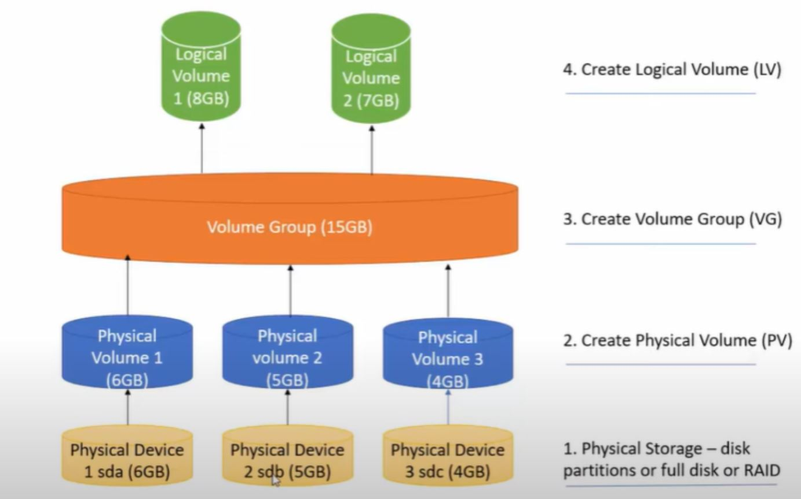

<h1 align="center" style="color: red;">Gestion de stockage</h1>

## Introduction
👋 Dans cette section, nous allons explorer comment gérer les disques, les partitions, LVM et stratis sous un environnement Redhat Linux.
## Disque & Partitions:
<p align="center">
  
</p> 


### théorie:

- partitionnement: créer une ou plusieurs zones de stockage indépendantes.
- Organisation du disque avec MBR: maximum 4 partitions: 4 principaux et une partition étendue qui peut contenir plusieurs partitions logiques.
- exemple: 
pour périphérique SATA:  
on dit /dev/sda pour la première  disque sata.  
on dit /dev/sdb pour le deuxième disque sata…  
on dit /dev/sda1 pour la première partition de la première disque sata.  
on dit /dev/sda2 pour la deuxième partition du premier disque sata…  
- Les formats des systèmes de fichiers: c’est comment linux organise et stocke ses fichiers sur un périphérique de stockage: ext2, ext3, ext4, jfs, xfs..  
- montage: intègre un système de fichiers dans l'arborescence, une fois que vous avez monté le disque, vous pouvez naviguer dans ses fichiers comme si c'étaient ceux de votre ordinateur principal.  
- partition SWAP : Une partition swap sur un disque dur agit comme un espace de stockage temporaire utilisé par le système d'exploitation pour déplacer des données inactives de la mémoire vive (RAM) vers le disque.  
- `lsblk` → pour voir les disques et les partitions
- `fdisk /dev/nom_disque then n (new)`→  pour créer une partition.  
- `mkfs.filesystem_name /dev/nom_partition`→  pour formater une partition.
- `mkdir /mount_point` →  créer le point de montage.
- `blkid /dev/nom_partition` →  afficher le uuid de partition.
- `echo “UUID=uuid_of_the_partition		/mount_dir	xfs		defaults	0 0” >> /etc/fstab `
then 
- `mount -a`→  monter la partition (permanent)  
pour effacer une partition déjà monté:  
RQ: il faut démonter avant d' effacer une partition.
effacer la ligne dans /etc/fstab si c’est monté (permanently) then mount -a.  
- `umount nom_partition`.
- `fdisk /dev/nom_disque then d (delete) then w`→  pour effacer la partition.  
RQ: il faut démonter avant de changer le type de partition (par exemple to swap)  
pour créer une partition SWAP( créer une partition puis changer le type en swap):  
- `fdisk /dev/nom_disk then t (change type),L(list all hex code) , chose the code of swap:82 ,w (write)`→  pour changer le type de swap.  
- `mkswap /dev/nom_partition` →  pour formater une partition SWAP.  
- `free -m `→  pour vérifier SWAP.  
- `echo “uuid_of_the_SWAPpartition	none	swap	defaults	0 0” >> /etc/fstab then swapon -a`→  monter la partition (permanent)  
- `swapoff -a `→  pour annuler le swap  
## Lab 07

#### Q0. Create a new partition (/dev/sdb1) with a size of 500MB.
#### Q1. Format the partition as ext3.
#### Q2. Ensure that the partition is mounted at startup in /mnt.
``` bash
fdisk /dev/sdb …
mkfs.ext3 /dev/sdb1
echo “UUID=uuid_of_the_partition		/mnt	ext3		defaults	0 0” >> /etc/fstab 
mount -a
```
#### Q3. Create and activate a 1GB swap partition without affecting the original swap (/dev/sdb2).
``` bash
fdisk /dev/sdb …
mkswap /dev/sdb2
echo “UUID=uuid_of_the_partition		none		swap	0 0” >> /etc/fstab 
swapon -a
```
#### Q4. Create a 2G swap partition which takes effect automatically at boot-start, and it should not affect the original swap partition. 
``` bash
(même étapes: créer partition 2G avec type SWAP puis monter la partition swap permanently) 
```
## gestion par volume logique (LVM)
### théorie:
pour obtenir un volume logique on doit:
- avoir un volume physique (PV) depuis une partition.
- créer un volume group (VG) depuis des volumes physiques (PV).
- créer un volume logique.
Pourquoi? ( on a besoin d’un volume de 8G et on a que des partitions moins que 8G; solution: utiliser le concept de LVM)
<p align="center">
  
</p> 

RQ: par défaut si on crée le vg un petit pourcentage sera réservé pour les métadonnés (un PE a chaque partition(pv))
#### création d’un LV en vous donnant une taille exacte :
- `pvcreate /dev/partition_name` →  pour créer physical volume.
- `vgcreate vg_name /dev/partition_name1 /dev/partition_name2… `→  pour créer volume group.
- `lvcreate -L sizeunity -n lv_name vg_name` →  pour créer le logical volume.
monter le logical volume:
- `mkdir /mount_point` →  créer le point de montage
- `mkfs.xfs /dev/vg_name/lv_name` →  pour donner un filesystem: formater  lv.
- `echo “/dev/vg_name/lv_name	/mount_point	xfs	defaults	0 0” >> /etc/fstab then mount -a` →  pour monter la lv .  
On peut aussi étendre la lv: on peut avoir deux cas si l’espace de vg est suffisant et si l’espace de vg est insuffisant.
##### si l’espace de vg est suffisant:
- `vgs` →  pour voir les détails de vg (free size)
- `lvextend -r -L +<size> /dev/group_name/lv_name` →  pour étendre le lv.
- `lvs` →  pour vérifier
##### si l’espace de vg est insuffisante: (étendre vg puis lv)
- `vgs` →  pour voir les détails de vg (free size)
- `pvs` →  voir s’il ya un pv sinon créer une →  pvcreate /dev/partition_name.
- `vgextend vg_name name_free_physical_volume` →  pour étendre la vg.
- `lvextend -r -L +<size> /dev/group_name/lv_name` →  pour étendre le lv.(un lv déja monté ayant un filesystem -r :pour étendre aussi le filesystem)
- `lvs` →  pour vérifier
#### création d’un LV en vous donnant nombre de PE: extent et sa taille de PE:
- `vgdisplay` →  pour voir le PE
- `vgcreate -s <size_extent>unity name_of_grp /dev/pv_name /dev/pv_name…` →  pour créer un volume group ayant la taille de PE size_extent.
- `lvcreate -l <number> -n name_of_lv name_of_grp` →  pour créer lv selon le nombre de PE.
size of PE * number of PE = size of LV
- `lvs` →  pour vérifier: la taille doit être  <number>*<size_extent>.
RQ: pour supprimer une lv il faut la démonter ( umount lvname, comment line in /etc/fstab et mount -a) 
- `lvremove /dev/grp_name/lv_name`
RQ: pour supprimer une vg, vgremove grp_name

## Lab 08
#### Q0. Create a Logical Volume partition, Below mentioned the conditions: Volume Group is 510MB and named as vol0; Logical Volume is 80 MB and named as lv0 File type is xfs  and permanently mounted to /cms file system.
510/4=127.5 → on a 127 PE → le système ajoute une PE =128 PE
128*4=512! or on a besoin de 510.
solution ici de changer la taille de PE de 4 à 2:
création partition 510M+PE=2:

```bash 
fdisk /dev/sda then n then +512m then w (par défaut le vg réduit un pe=2)
vgcreate -s 2M vol0 /dev/sda1
lvcreate -L 80M -n lv0 vol0
mkdir /cms
mkfs.xfs /dev/vol0/lv0
echo “/dev/vol0/lv0		/cms		xfs	defaults 0 0” >> /etc/fstab
```
#### Q1. Create a Logical Volume Lvi with 60 extents ;Volume Group Vgi with 16MB extent size Mount it permanently under /record with file system ext3.
<!--
créer partition plus que 60*16 (/dev/sda2)
```bash 
vgcreate -s 16M vgi /dev/sda2
lvcreate -l 60 -n lvi vgi
mkfs.ext3 /dev/vgi/lvi
mkdir /record
echo “/dev/vgi/lvi    /record ext3    defaults 0 0” >> /etc/fstab
mount -a
 ```
 -->
<!--
#### Q2. Resize the LV named 'lv0'=152M so that it falls within the range of 200MB to 300MB.
création de lv0:
```bash 
fdisk /dev/sda then +156M (152+4PE) → vgcreate vg /dev/sda1 → 
lvcreate -L 152M -n lv0 vg
``` 
corrigé:
combien de PE tel que max=300: lvextend -l ? /dev/vg/lv0
max-152=300-152=148
PE=4*?=148 (car pe=4)
?= nb PE=148/4=37 PE 
NB: partition → vgcreate/vgextend réduit une PE
étendre vg: on doit  ajouter une PE a la partition. → création partition:
fdisk /dev/sda then +152M(148+4) → on obtient /dev/sda2 :152
vgextend vg /dev/sda2 → (la vg est étendu de 152-4=148)
lvextend -L +148M /dev/vg/lv0 ou lvextend -l 37 /dev/vg/lv0

-->
