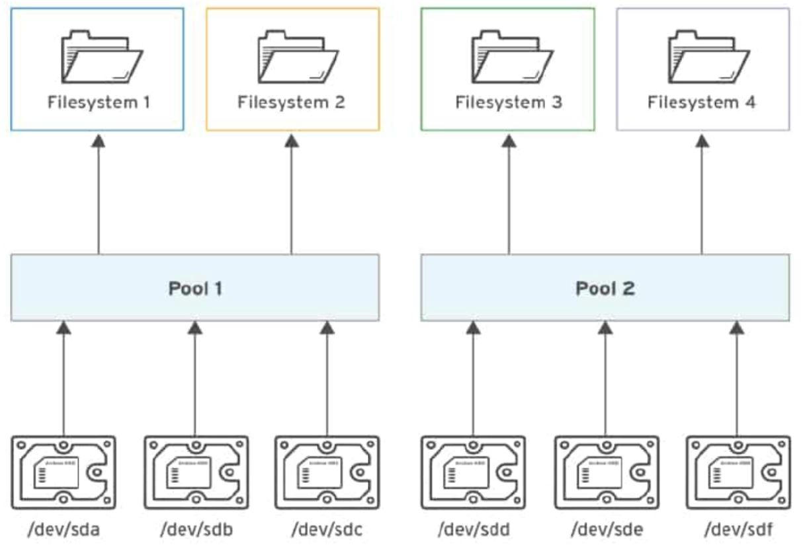

# Storage Management

## Introduction
👋 In this section, we will explore how to manage disks, partitions, LVM, and Stratis in a Red Hat Linux environment.

## Disks & Partitions:
<p align="center">
  
</p> 

### Theory:

- **Partitioning**: creating one or more independent storage zones.
- **MBR Disk Structure**: maximum 4 partitions: 4 primary or 3 primary + 1 extended (which can contain multiple logical).
- Example:
  - SATA device:
    - `/dev/sda`: first SATA disk.
    - `/dev/sdb`: second SATA disk.
    - `/dev/sda1`: first partition of the first disk.
    - `/dev/sda2`: second partition of the first disk.
- **File System Types**: the way Linux organizes and stores its files on a device: ext2, ext3, ext4, jfs, xfs...
- **Mounting**: integrates a file system into the directory tree; once mounted, you can navigate its files like any other directory.
- **SWAP partition**: a temporary space on disk used to move inactive data from RAM.

### Commands:
- `lsblk` → view disks and partitions
- `fdisk /dev/disk` then `n` → create a partition
- `mkfs.filesystem_type /dev/partition` → format the partition
- `mkdir /mount_point` → create the mount point
- `blkid /dev/partition` → get UUID
- Add to `/etc/fstab`:
  ```
  UUID=<uuid>  /mount_dir  xfs  defaults  0 0
  ```
- `mount -a` → mount all entries from `/etc/fstab`
- `umount /partition`
- `fdisk /dev/disk` then `d`, then `w` → delete the partition

### SWAP Partition:
- `fdisk /dev/disk` → create partition, then `t`, then type `82`
- `mkswap /dev/partition`
- `free -m` → verify
- Add to `/etc/fstab`:
  ```
  UUID=<uuid> none swap defaults 0 0
  ```
- `swapon -a` → activate
- `swapoff -a` → deactivate

## Lab 07

### Q0. Create a new partition `/dev/sdb1` with 500MB  
### Q1. Format it as ext3  
### Q2. Mount it at `/mnt` during startup

```bash
fdisk /dev/sdb …
mkfs.ext3 /dev/sdb1
echo “UUID=uuid  /mnt  ext3  defaults 0 0” >> /etc/fstab
mount -a
```

### Q3. Create and activate a 1GB SWAP partition (`/dev/sdb2`) without affecting existing SWAP

```bash
fdisk /dev/sdb …
mkswap /dev/sdb2
echo “UUID=uuid  none  swap  0 0” >> /etc/fstab
swapon -a
```

### Q4. Create a 2GB SWAP partition active at boot

(Same steps as above)

## Logical Volume Management (LVM)

### Theory:
<p align="center">
  
</p> 
To obtain a logical volume, we must:

* Have a physical volume (PV) created from a partition.
* Create a volume group (VG) from physical volumes (PVs).
* Create a logical volume.

*Why?* (We need an 8G volume, but we only have partitions smaller than 8G. Solution: use the LVM concept.)
*Note:* By default, when we create the VG, a small percentage will be reserved for metadata (one PE per partition (PV)).

### Commands:

*Note:* by default, if we create the VG a small percentage will be reserved for metadata (one PE per partition (PV))

#### Creation of an LV by giving you an exact size:

* pvcreate /dev/partition_name → to create a physical volume.
* vgcreate vg_name /dev/partition_name1 /dev/partition_name2… → to create a volume group.
* lvcreate -L sizeunity -n lv_name vg_name → to create the logical volume.

Mount the logical volume:

* mkdir /mount_point → create the mount point
* mkfs.xfs /dev/vg_name/lv_name → to assign a filesystem: format the LV.
* echo “/dev/vg_name/lv_name	/mount_point	xfs	defaults	0 0” >> /etc/fstab then mount -a → to mount the LV.

We can also extend the LV: we can have two cases — if the VG space is sufficient, and if the VG space is insufficient.

##### If VG space is sufficient:

* vgs → to view VG details (free size)
* lvextend -r -L +<size> /dev/group_name/lv_name → to extend the LV.
* lvs → to verify

##### If VG space is insufficient: (extend VG then LV)

* vgs → to view VG details (free size)
* pvs → check if there’s a PV, otherwise create one → pvcreate /dev/partition_name.
* vgextend vg_name name_free_physical_volume → to extend the VG.
* lvextend -r -L +<size> /dev/group_name/lv_name → to extend the LV. (an LV already mounted with a filesystem — -r: to also extend the filesystem)
* lvs → to verify

#### Creation of an LV by giving number of PEs: extent and its PE size:

* vgdisplay → to view the PE
* vgcreate -s <size_extent>unity name_of_grp /dev/pv_name /dev/pv_name… → to create a volume group with a PE size of size_extent.
* lvcreate -l <number> -n name_of_lv name_of_grp → to create an LV based on the number of PEs.
  *size of PE* × *number of PE* = *size of LV*
* lvs → to verify: the size must be <number>*<size_extent>.

*Note:* to delete an LV, you must unmount it (umount lvname, comment line in /etc/fstab and mount -a)

* lvremove /dev/grp_name/lv_name
  *Note:* to delete a VG, vgremove grp_name

## Lab 08

#### Q0. Create a Logical Volume partition. Below are the conditions: Volume Group is 510MB and named vol0; Logical Volume is 80MB and named lv0; File type is xfs and permanently mounted to the /cms file system.

510 / 4 = 127.5 → we have 127 PE → the system adds one PE = 128 PE
128 \* 4 = 512! But we only need 510.
*Solution*: change the PE size from 4 to 2:

Creating a 510M + PE = 2 partition:


```bash
fdisk /dev/sda then n then +512m then w (by default, the VG reduces one PE = 2)
vgcreate -s 2M vol0 /dev/sda1
lvcreate -L 80M -n lv0 vol0
mkdir /cms
mkfs.xfs /dev/vol0/lv0
echo “/dev/vol0/lv0		/cms		xfs	defaults 0 0” >> /etc/fstab

```

#### Q1. Create a Logical Volume Lvi with 60 extents ;Volume Group Vgi with 16MB extent size Mount it permanently under /record with file system ext3.

create a partition larger than 60×16 (/dev/sda2)

```bash
vgcreate -s 16M vgi /dev/sda2
lvcreate -l 60 -n lvi vgi
mkfs.ext3 /dev/vgi/lvi
mkdir /record
echo “/dev/vgi/lvi  /record  ext3  defaults 0 0” >> /etc/fstab
mount -a
```

#### Q2. Resize the LV named lv0 = 152M so that it falls within the range of 200MB to 300MB.

**Creation of lv0:**
fdisk /dev/sda then +156M (152 + 4 PE) → vgcreate vg /dev/sda1 →
lvcreate -L 152M -n lv0 vg

*Correction:*
```bash
How many PEs are needed so that the max = 300:
lvextend -l ? /dev/vg/lv0

max - 152 = 300 - 152 = 148
PE = 4 \* ? = 148 (since PE = 4)
? = number of PEs = 148 / 4 = 37 PE

*Note:* partition → vgcreate / vgextend reduces one PE

To extend the VG, we must add a PE to the partition. → Create a partition:
fdisk /dev/sda then +152M (148 + 4) → we get /dev/sda2: 152M
vgextend vg /dev/sda2 → (VG is extended by 152 - 4 = 148M)

Then:
lvextend -L +148M /dev/vg/lv0 or lvextend -l +37 /dev/vg/lv0
```

## Advanced Storage with Stratis
<p align="center">
  
</p> 

### Theory:

- Combine multiple block devices into a single storage pool.
- Create thin-provisioned filesystems from the pool.
- Snapshots supported.

### Commands:

```bash
dnf install stratis-cli stratisd
systemctl enable --now stratisd
wipefs -a /dev/sda
stratis pool create poolname /dev/sda
stratis filesystem create poolname fsname
blkid /dev/stratis/poolname/fsname
echo “UUID=... /mount xfs x-systemd.requires=stratisd.service 0 0” >> /etc/fstab
mount -a
```

To delete:
```bash
umount /dev/stratis/pool/fsname
stratis filesystem destroy pool fsname
stratis pool destroy pool
```

## Lab 03

### Q0. Create 1GB SWAP, persistent

```bash
fdisk /dev/sda → +1G
fdisk → t → 82
mkswap /dev/sda1
echo “UUID=...  none  swap  defaults 0 0” >> /etc/fstab
swapon -a
```

### Q1. LV `lv0_ext4` with 30 extents, VG `vgroups` with 2G size, PE = 64M, mount on `/home/lv0`

```bash
fdisk /dev/sdb → +2112M
pvcreate /dev/sdb1
vgcreate -s 64M vgroups /dev/sdb1
lvcreate -l 30 -n lv0_ext4 vgroups
mkfs.ext4 /dev/vgroups/lv0_ext4
mkdir /home/lv0
echo “/dev/vgroups/lv0_ext4  /home/lv0  ext4  defaults 0 0” >> /etc/fstab
mount -a
```

### Q2. Create VFAT LV and mount on `/fatVolume`

```bash
mkfs.vfat /dev/vg/lv
mkdir /fatVolume
echo “/dev/vg/lv  /fatVolume  vfat  defaults 0 0” >> /etc/fstab
mount -a
```

### Q3. Create Stratis pool `pool1`, filesystem `fs1`, mount at `/mnt/fs1`, add 1GB file, create snapshot `snap1`, mount it on `/mnt/snap1`

```bash
stratis pool create pool1 /dev/sdb1
stratis filesystem create pool1 fs1
dd if=/dev/zero of=/mnt/fs1/fichier bs=1M count=1024
stratis filesystem snapshot pool1 fs1 snap1
mkdir /mnt/snap1
echo “/dev/stratis/pool1/snap1  /mnt/snap1  xfs  x-systemd.requires=stratisd.service 0 0” >> /etc/fstab
mount -a
```
