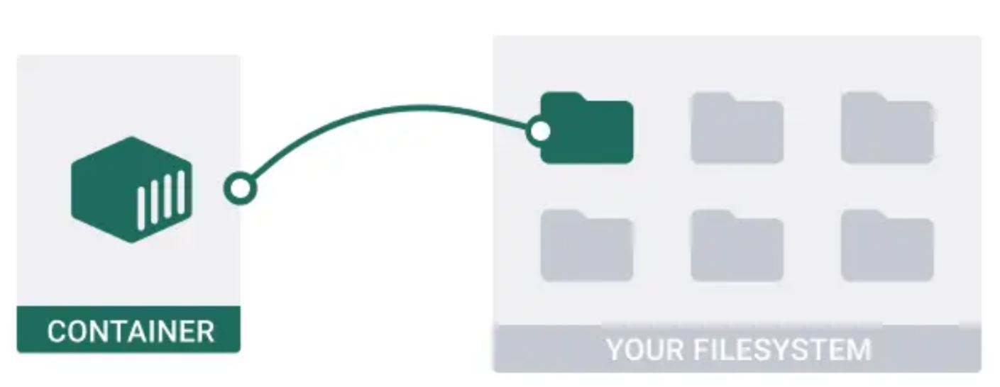

# Container Management

## Introduction
👋 In this section, we will explore how to manage containers: rsyslog, http, and pdf-converter.
<p align="center">
  
</p>  

<p align="center">
  
</p> 
1. Pull a container image (or build one)  
2. Run a container as a rootless user  
3. Map the container to a local directory  
<p align="center">
  
</p>  

### Rsyslog Container

- Install required packages: `dnf install podman container-tools`
- Create user: `useradd user1`, then `passwd user1`
- Allow user processes to persist after logout: `loginctl enable-linger user1`
- Create and set permissions on local directory: `mkdir /local_path`, then `chown user1:user1 /local_path`
- SSH into the user: `ssh user1@localhost`
- Connect to registry and pull image:
  - `podman login registry.redhat.io`
  - `podman search rsyslog`
  - `podman pull image_url`
  - Or for exams:
    - `wget <dockerfile_path>`
    - `podman build -t imageName .`
    - `podman images`
- Run and map container: 
  - `podman run -d --name container_name -v /local_path:/container_path:Z image_id`
  - Example: `podman run -d --name rsyslog -v /local_path:/var/log:Z image_id`
- Display containers: `podman ps`
- Run container as a user service (systemd):
  - `mkdir -p /home/user1/.config/systemd/user`
  - `cd /home/user1/.config/systemd/user`
  - `podman generate systemd --name container_name --files --new`
  - Edit the generated service file to use `restart=always`
  - Reload and enable service: 
    - `systemctl --user daemon-reload`
    - `systemctl --user enable --now service_name`
  - After reboot: `systemctl --user status service_name`
  - Check logs as root: `journalctl | grep container-rsyslog.service`

### Apache Container
<p align="center">
  
</p>  
Launch an httpd container from the image: `registry.access.redhat.com/ubi9/httpd-24`

Requirements:
- Run as rootless user `webadmin`
- Accessible on host port 8081 (container port = 8080)
- Container name: `web`
- Map `/home/webadmin/html` to `/var/www/html` in the container

Steps:
```bash
useradd webadmin
passwd webadmin
loginctl enable-linger webadmin
mkdir /home/webadmin/html
echo 'hi' > /home/webadmin/html/index.html
chown webadmin:webadmin /home/webadmin/html /home/webadmin/html/index.html
ssh webadmin@localhost
podman pull registry.access.redhat.com/ubi9/httpd-24
podman run -d --name web -p 8081:8080 -v /home/webadmin/html:/var/www/html:Z image_id
mkdir -p ~/.config/systemd/user
cd ~/.config/systemd/user
podman generate systemd --name web --files --new
systemctl --user daemon-reload
systemctl --user enable --now container-web.service
curl localhost:8081
podman exec -it web /bin/bash
bash-5.1$ curl localhost:8080

```
Check container status and logs:
```bash
systemctl --user status container-web.service
podman exec -it web bash
curl localhost:8080
journalctl | grep container-web.service
```

### PDF Converter Container
<p align="center">
  
</p>  
This container runs a Python script `pdf_converter.py` to convert text files to PDFs using Podman.

Steps:
```bash
dnf install podman container-tools
useradd pod
passwd pod
mkdir -p /data/input /data/output
chown -R pod:pod /data/*
chmod -R 777 /data
chmod -R 777 /data/input /data/output
echo "file" > /data/input/file.txt
chown pod:pod /data/input/file.txt
loginctl enable-linger pod
ssh pod@localhost
wget https://raw.githubusercontent.com/sachinyadav3496/Text-To-PDF/master/pdf_converter.py
wget https://raw.githubusercontent.com/sachinyadav3496/Text-To-PDF/master/Dockerfile
podman build -t pdf .
podman run -d --name pdfconverter -v /data/input:/data/input:Z -v /data/output:/data/output:Z image_id
mkdir -p ~/.config/systemd/user
cd ~/.config/systemd/user
podman generate systemd --name pdfconverter --files --new
systemctl --user daemon-reload
systemctl --user enable --now container-pdfconverter.service
podman exec -it pdfconverter bash
ls /data/output
exit
reboot
journalctl | grep container-pdfconverter.service
```
