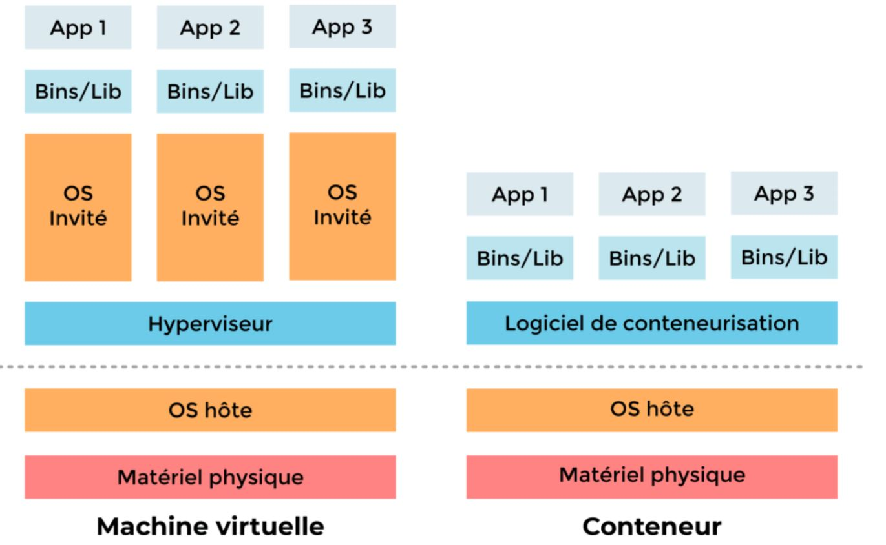
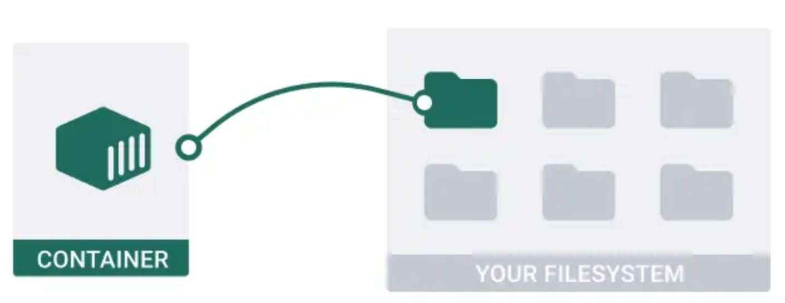

<h1 align="center" style="color: red;"> Gestion des Conteneurs</h1>

## Introduction
👋 Dans cette section, nous allons explorer comment gérer les conteneurs: rsyslog, http et pdf-coverter.  

  

  

- 1) pull a container image: (or build)
- 2) run a container as rootless (user):
- 3) map the container to a local directory:

  

  

### conteneur Rsyslog:
- `dnf install podman container-tools` → installer les packages nécessaires.
- `useradd user1 then passwd user1` → création user.
- `NB:loginctl enable-linger user1` → pour permettre aux processus de l'utilisateur de persister même après la déconnexion.
- `mkdir /chemain_local then chown user1:user1 /chamain_local` → créer le répertoire a mapper.
- `ssh user1@localhost` → se connecter a user via ssh.`
- `(podman login registry.redhat.io → se connecter au registry`
`podman search rsyslog → rechercher une image (exemple rsyslog)`
`podman pull url_image_searched → rechercher une image pdf-converter.) `
NB: dans l’examen tu faits: 
- `wget <path_dockefile> `
`podman build -t imageName .`
`podman images` → afficher les images.
- `podman run -d –-name <container_name> -v <chemain_local>:<chemain_container>:Z <id_image>`→ run and map the container (étape2+étape3).
- `podman run -d –-name rsyslog -v /chemain_local:/var/log:Z <id_image>`
- `podman ps` → afficher les conteneurs.
- 4) run the container as a service (en tant que user)(systemd):
- `mkdir -p /home/user1/.config/systemd/user` → Créer le répertoire pour la configuration systemd utilisateur.
- `cd /home/user1/.config/systemd/user` → Accéder au répertoire de configuration systemd utilisateur.
- `podman generate systemd --name container_name --files --new` → Générer un fichier de service systemd pour le conteneur.
RQ: the service name will be container-<container_name>.service
- `vim service_name.service`
[service]
restart=on-failure ⇒ restart=always
wantedBy=multi-user.target
- `systemctl --user daemon-reload`  → Recharge la configuration du gestionnaire systemd pour l'utilisateur
- `systemctl --user enable --now service_name`  → Active et démarre le service systemd pour l'utilisateur.
reboot machine then (user1) :`systemctl –-user status service_name` → Vérifier le statut du service systemd après reboot.
`journalctl | grep container-rsyslog.service` → Vérifier le service en tant que root.

<!--

Pratique:
conteneur Apache:
Launch an httpd container in Podman from this image registry.access.redhat.com/ubi9/httpd-24 that meets the following conditions:
The container is started as a rootless container by the user webadmin.
The container must be accessible on port 8081 of the host.
The container uses the name web.
The directory /home/webadmin/html on the host must be mapped to /var/www/html in the container.
Generate a systemd service for this container (using the path ~/.config/systemd/user).
Rq: podman run -d –-name <container_name> -p <user_port>:<container_port> -v <chemain_local>:<chemain_container>:Z <id_image>→ option p for port mapping.
Rq: podman rm --force  <id_conteneur>
   podman ps
   podman rmi --force <id_image>
   podman images → pour effacer un conteneur.
useradd webadmin	 passwd webadmin
loginctl enable-linger webadmin  
mkdir /home/webad/html
echo ‘hi’ > /home/webadmin/html/index.html
chown webadmin:webadmin /home/webadmin/html
chown webadmin:webadmin /home/webadmin/html/index.html
ssh webadmin@localhost
podman pull registry.access.redhat.com/ubi9/httpd-24
podman images
podman inspect <id_image> | grep -i expose → vérifier le port de conteneur à créer : 8080 pour cette image 
podman run -d --name web -p 8081:8080 -v /home/webadmin/html:/var/www/html:Z <id_image>
podman ps
mkdir -p ~/.config/systemd/user
cd ~/.config/systemd/user
podman generate systemd --name web --files --new
systemctl --user daemon-reload
systemctl --user enable --now container-web.service
systemctl --user status  container-web.service
curl localhost:8081
podman exec -it web bash
curl localhost:8080
(root) → journalctlctl | grep container-web.service

conteneur pdfconverter:
Théorique:
Le conteneur "pdf-converter" est conçu pour exécuter un script Python nommé "pdf_converter.py" afin de convertir des fichiers texte en fichiers PDF. L'environnement est configuré pour fonctionner sous Red Hat en utilisant ‘Podman’ plutôt que Docker. Un fichier Dockerfile est fourni, détaillant les étapes nécessaires à la construction de l'image Podman. Une fois cette image construite, le conteneur peut être lancé pour effectuer la conversion des fichiers texte en PDF.

/data/input			/data/output

dnf install podman container-tools
useradd pod
passwd pod  → création utilisateur pod.
mkdir -p /data/input /data/output  → création des répertoires locaux.
chown -R pod:pod /data/* 
ls -ld /data
chown pod:pod /data  → changer le propriétaire et le groupe propriétaire de répertoire data et de ses contenus en pod et pod.
chmod -R 777 /data/*
or chmod -R 777 /data/input 
chmod -R 777 /data/output   → ajouter toutes les permissions au répertoires.
echo “file” > /data/input/file.txt  → ajouter un fichier .txt au répertoire input pour simuler la conversion.
chown pod:pod /data/input/file.txt  → changer le propriétaire et le groupe propriétaire de fichier en pod et pod.
loginctl enable-linger pod
ssh pod@localhost
wget https://raw.githubusercontent.com/sachinyadav3496/Text-To-
PDF/master/pdf_converter.py
wget https://raw.githubusercontent.com/sachinyadav3496/Text-To-
PDF/master/Dockerfile
ls
→ télécharger dockerfile et pdf_converter.py qui sont nécessaires pour la construction de l’image et la conversion.
podman build -t pdf .
podman images  → construire l’image depuis dockerfile.
podman run -d --name pdfconverter -v /data/input:/data/input:Z -v /data/output:/data/output:Z <image_id>
podman ps  → exécuter le conteneur tel que /data/input en local sera mappé sur /data/input dans le conteneur pour stocker les fichiers .txt, et /data/output en local sera mappé sur/data/output dans le conteneur pour stocker le fichier convertit en pdf.
mkdir -p ~/.config/systemd/user
cd .config/systemd/user
podman generate systemd --name pdfconverter --files --new
systemctl --user daemon-reload
systemctl --user enable --now container-pdfconverter.service
systemctl --user restart --now container-pdfconverter.service
systemctl --user status container-pdfconverter.service
 → run it as a service.
podman exec -it pdfconverter bash
ls /data/output → vérifier que le fichier.txt et convertit en fichier.pdf
exit 
(root) reboot
journalctl | grep container-pdfconverter.service
 → vérifier le service en tant que root.
-->