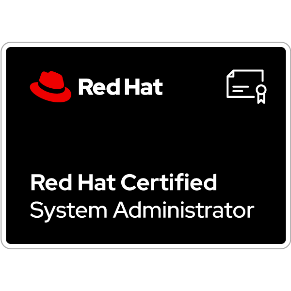

# RHCSA Training

## System Administration under Red Hat Enterprise Linux

### Introduction
👋 Welcome to this course on system administration with Red Hat Enterprise Linux.  
This course is designed to prepare you for the RHCSA (Red Hat Certified System Administrator) exam!

🔧 **Why this course?**
- **Practical Skills**: Learn how to install, configure, and manage Red Hat Enterprise Linux systems.
- **Recognized Certification**: Earn the RHCSA certification, which is globally recognized and highly sought after by employers.
- **Career Opportunities**: Increase your chances of landing jobs as a system administrator, DevOps engineer, and more.

📚 **What you will learn:**
- **Installation and Configuration**: Deploy and configure Red Hat Enterprise Linux for various environments.
- **User and Group Management**: Learn to manage user accounts, groups, and permissions.
- **Automation**: Use Shell scripts to automate repetitive tasks.
- **System Services**: Manage critical services and ensure they are running correctly.
- **Storage and Network Management**: Configure and manage storage and network settings.

🎯 **Course Objectives:**
1. Provide you with the knowledge and skills necessary to pass the RHCSA exam.
2. Prepare you to effectively manage Red Hat Enterprise Linux systems in a professional environment.
3. Build your system administration expertise through practical exercises and interactive labs.

🎓 **Who is this course for?**
- **Beginners in System Administration**: Those looking to start a career in system administration.
- **IT Professionals**: Those who want to certify their skills and advance in their careers.
- **Students**: Those studying computer science and looking to gain practical experience.

Join us on this journey and become a certified Red Hat system administrator! 🚀

## Table of Contents
1. Installation of Red Hat Enterprise Linux & Registration
2. Basic Commands & Shell Scripts
3. User and Group Management
4. Task Automation
5. Service Management
6. Archiving & Compression
7. NFS & AutoFS
8. Storage Management
9. Container Management
10. BaseOS & AppStream Repositories
11. Networking
12. Root Password Reset
